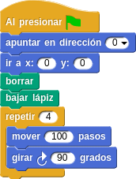
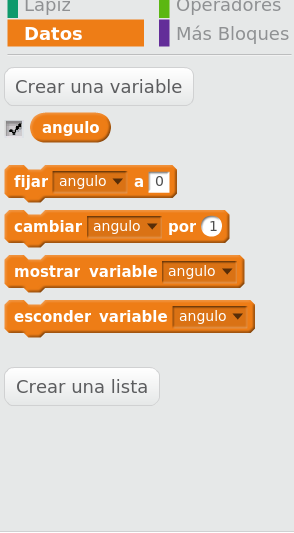
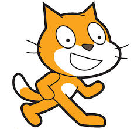
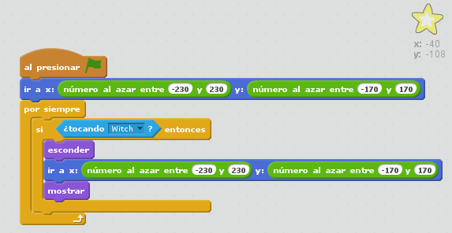

# Scratch, aprender programando [(191813GE031)](https://www.juntadeandalucia.es/educacion/secretariavirtual/consultaCEP/actividad/191813GE031/) 

## CEP Guadix

### José Antonio Vacas @javacasm

## https://github.com/javacasm/ScratchGuadix

* * * 

# [Scratch](https://scratch.mit.edu/)

### Es un entorno de programación creado en el **MIT** por [Mitchel Resnick](https://www.media.mit.edu/people/mres)
([A Different Approach to Coding](https://medium.com/bright/a-different-approach-to-coding-d679b06d83a#.734u3gfm8) y [su mágnifica charla TED](https://www.ted.com/talks/mitch_resnick_let_s_teach_kids_to_code?language=es))

Podemos usarlo desde [acceso web](https://scratch.mit.edu/projects/editor) y como [aplicación de escritorio](https://scratch.mit.edu/scratch2download/).

[(Hay 2 versiones para usar offline: la 1.4 y la 2.0)](./versiones.md)

La versión 2.0 usa tecnología propietaria de Adobe (Air), por lo podría no funcionar en todos los dispositivos

Existe una enorme [comunidad](https://scratch.mit.edu/starter_projects/)

## Interface

## Bloques

* Movimiento
* Apariencia
* Sonidos
* Lápiz
* Datos
* Eventos
* Control
* Sensores
* Operadores
* Más bloques

## Formas de los bloques

## Puntos de partida

## ¡¡Vamos a dibujar!!

### Es un sistema pensado para ser muy adaptable

### Por eso tenemos que dar todos los pasos

### Tendremos que decir cuando usamos el lápiz y donde empezamos a dibujar

## Cuadrado

### Vamos a dibujar un cuadrado

### Tenemos claros los pasos:
	1. Línea
	2. Giro
	3. Línea
	4. Giro
	5. Línea
	6. Giro
	7. Línea
	8. Giro

## Antes de hacer otro ejemplo vamos a guardar este. Podemos hacerlo dándole nombre y también podemos descargarlo a nuestro PC

### ¡¡Pero podemos hacerlo más fácil¡¡
	Vamos a repetir 4 veces:
		1. Línea
		2. Giro

#### Usaremos el bucle

* * *

### ¿ Y si hacemos más de 4 giros?

### ¿Y si repetimos muchos cuadrados?

# Movimientos Relativos y absolutos

## Vamos a ver que podemos hacer casi siempre los cambios (movimientos, cambios de color,...) de dos formas:

* Fijando: damos un valor concreto
* Cambiando: damos el cambio que se va a hacer.

#### Conviene prestar especial atención a las coordenadas y a los movimientos

## Eventos

#### Los eventos son sucesos que marcan el funcionamiento de nuestro programa.

Pueden ser:

* Movimientos de ratón
* Pulsaciones de teclas
* Pulsar la bandera verde
* Enviar mensajes

###  Ejercicio: Mover una imagen por pantalla con las teclas

### Aspecto

#### Podemos cambiar el aspecto de los dibujos con diferentes opciones:

* Podemos cambiar el color del lápiz con las opciones de los bloques de lápiz
* Cambiar ancho

Los parámetros tienen un rango: el color entre 0 y 200 de manera cíclica

### Ejercicio: dibujar una linea con todos los colores disponibles (cambiar a cono de colores)

## Variables

### Nos permiten almacenar valores que pueden cambiar

# Tarea 0: rehacer el dibujo del polígono definiendo variables

### Podemos definir las variables para decidir el flujo de ejecución

# Tarea 1: Utilizando líneas haz un programa que permita dibujar un poligono según una variable con su número de lados

## Creando nuestros propios bloques (objetos)

### Scratch nos permite definir nuevos bloques

Ejercicio: Dibujar una estralla formada por n polígonos de m lados, cada uno de un color

## Sentencias de Control

### Usando bucles repetitivos
### Ejercicio : estrella de 60 cuadrados de colores

#### Nos van a permitir establecer el orden de ejecución de los bloques:

* Podemos hacer bucles: contar y  mientras
* Condicionales: dependiendo de las operaciones lógicas

## Moviéndonos por la pantalla

## Personaje

### Cada personaje lleva su propio programa

## Las coordenadas son unas "variables especiales"

* Vamos a mover un personaje por la pantalla

* Usaremos las teclas (sensores y condicionales)

# Ejercicio: Vamos a mover un personaje con las teclas

### Un mismo personaje puede tener varios disfraces

### Ejercicio: crea una animación con varios disfraces

### Los personajes hablan!!

### Ejercicio: Crea varios personajes y muévelos por pantalla

#### ¿ Cómo hacemos que haya varios personajes?

### Añadiendo azar

### Pueden interaccionar entre sí

### Añadiendo puntos

### Sonido

### [Clones](https://wiki.scratch.mit.edu/wiki/Cloning)

Se trata de crear copias de un personaje

## Ejemplos

[Tutoriales de dsigno](http://programamos.es/creando-un-videojuego-paso-a-paso-con-scratch-desde-cero/)

[libro virtual sobre scratch](http://www.tallertecno.com/libro.html#scratch)

[Tutorial básico sobre movimiento de personajes](http://programamos.es/creando-un-videojuego-paso-a-paso-con-scratch-desde-cero/)

## Referencias

[Diversos cursos](http://paunin.blogspot.com.es/2015/11/quieres-aprender-scratch.html)

[MOOC UOC](https://mooc.scratch.uoc.edu/courses/course-v1:UOCx+UOC002+015_T1/info)

[Aprendiendo Scratch desde 0](http://programamos.es/creando-un-videojuego-paso-a-paso-con-scratch-desde-cero/)

[Presentación Scratch](http://www.slideshare.net/josepujolperez/introduccion-a-scratch)

[Tutoriales](http://www.educaciontrespuntocero.com/recursos/el-proyecto-scratch-de-los-viernes-i-moviendo-el-gato/29934.html)

[>> Alternativas a Scratch (Snap)](./Snap.md)
